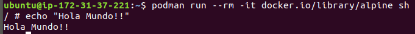

# Ejercicios del tema Contenedores y como usarlos.
### Ejercicio de objetivos: 
__Descargar y probar podman y buildah__

Como solo requeriamos de una terminal hemos levantado una maquinal virtual gratuita en AWS para realizar las pruebas.

Tras conectarnos hemos instalado podman y hemos listado su info:

Hemos hecho pull de la imagen de alpine y la hemos lanzado para recrear un pequeño holamundo.

Tras eso hemos instalado buildah y hemos comprobado como las imagenes de podman tambien estan disponibles para aquí. Además hemos creado un contenedor de la imagen de alpine.

Finalmente hemos instalado en el contendor python3 y hemos creado una nueva imagen de alpine con python a traves de él.

De esta manera hemos completado más o menos todas las opciones que nos ofrecen estos administradores de conetendores.

### Ejercicio 2: 
__Tomar algún programa simple, “Hola mundo” impreso desde el intérprete de línea de órdenes, y comparar el tamaño de las imágenes de diferentes sistemas operativos base, Fedora, CentOS y Alpine, por ejemplo.__

Se ha usado este Dockerfile para crear una imagen.

    FROM fedora

    COPY hello.py /app

    WORKDIR /app

    RUN yum update -y && yum upgrade -y \
        && yum install python3 -y

    CMD python3 hello.py

En lai magen podemos ver como se han descargado las imagenes de fedora, fedora/python y alpine. A partir de la imagen de fedora se ha creado una nueva imagen, llamada hello-fedora, usando el Dockerfile anterior.
Como podemos aprecior la imagen del repositorio es mucho menor que la creada añadiendole python. Ademas la clara vencedora en cuanto a tamaño es sin duda la imagen de alpine. Por ultimo hemos comprobado que la imagen esta correctamente creada lanzando un script de python que simplemente contiene:

    print("Hello Worl!!")