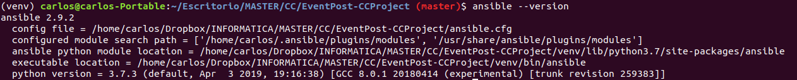
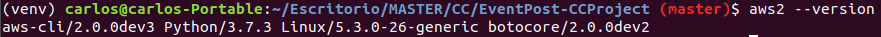
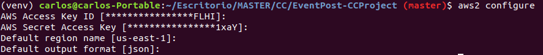
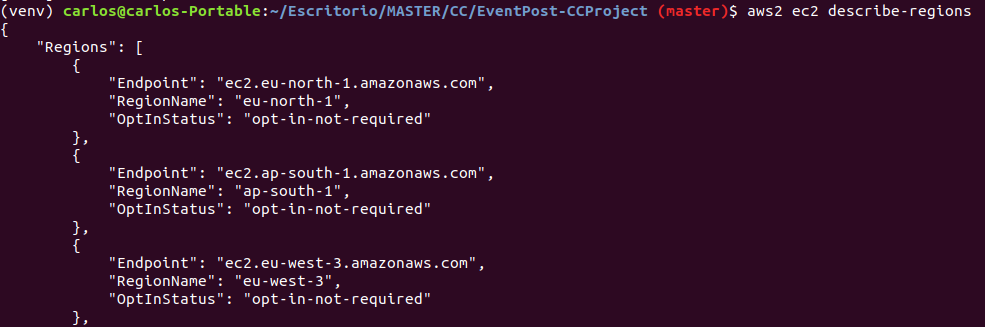
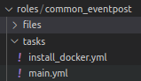

# Ejercicios del tema Provisionamiento en infraestructuras virtuales.
### Ejercicio de objetivos: 
__Instalar y configurar AWS CLI para funcionar con Ansible.__

Con ansible previamente instalado en el sistema mediante el uso de pip3:

En primer se instaló la AWS CLI haciendo uso de la [guia](https://docs.aws.amazon.com/es_es/cli/latest/userguide/install-cliv2-linux-mac.html) provista en la documentacion ofical de AWS.

El siguiente paso es la configuracion de la misma para poder meante ella administrar recursos en la nube. Esta paso es muy sencillo, solo requiere de la orden mostrada y completar algunos campos incluyendo las credenciales de AWS provistas para una cuenta.

Cabe destacar que es necesario realizar este paso cada vez que la sesion de AWS caduca (solo en caso de cuentas educativas y suele caducar cada varias horas). Tras esta operacion ya es posible obtener información y administrar recursos desde la CLI.

No obstante para que Ansible pueda interactuar sin problemas con AWS meadiante la API son necarios lo paquetes de Python boto y boto3 como indica su [documentación](https://aws.amazon.com/es/sdk-for-python/)
Tras estos pasos ya estariamos listos para trabajar con Ansible y AWS.

### Ejercicio 3: 
__Crear un rol common que haga ciertas tareas comunes que vayamos a usar en todas las máquinas virtuales de los microservicios de la asignatura (o, para el caso, cualquier otra asignatura).__

En nuestro caso hemos creado un rol para la instalación de Docker en una máquina virtual.
El primer paso para crear un rol con Ansible es ejecutar el comando 'ansible-galaxy init role-name'. Este comando crea una serie de directorios para alojar nuestro rol. Como no sacaríamos provecho de todos ellos ya que es un rol bastante simple hemos creado los directorios a mano.

Despues se ha creado un fichero 'install_docker.yml' que contiene en un bloque todas las tareas necesario para la instalación.

    # install_docker.yml 
    - name: Install Docker
    block:
        - name: Install Docker required packages
        apt: name={{ item }} state=latest update_cache=yes
        loop: [ 'apt-transport-https', 'ca-certificates', 'curl', 'software-properties-common', 'python3-pip']

        - name: Install Docker Module for Python
        pip:
            name: docker

        - name: Add Docker GPG apt Key
        apt_key:
            url: https://download.docker.com/linux/ubuntu/gpg
            state: present

        - name: Add Docker Repository
        apt_repository:
            repo: deb https://download.docker.com/linux/ubuntu bionic stable
            state: present

        - name: Update apt and install docker-ce
        apt: update_cache=yes name=docker-ce state=latest

Por último en el fichero 'main.yml', que alberga las tareas a ejecutar cuando se usa el rol, se han importado las tareas definidas en 'install_docker.yml'.

    # Role for installing Docker
    - name: Install Docker
    import_tasks: ./roles/eventpost/tasks/install_docker.yml

Para añadir más tareas bastaria con realizar el mismo proceso. Además al separar ambos fichero podemos importar las tareas en otros scripts por separado sin tener que usar el rol al completo.
